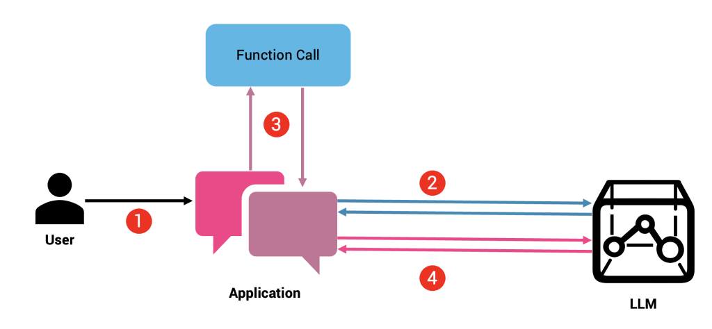

# Fundamentals of OpenAI Function Calling

### 1. **OpenAI Functions**

The application is a terminal based chat application. The source code is a continuation of the source code inside basic directory.

#### 1.1 What are functions calling and what is the need of it

- Function calling are a way to enhance the capabilities of the model and to call external sytems, APIs and tools. Generally, model is trained under a large amount of data for that is used to answer the queries of the user. Sometimes, it happens that the model is not able to generate approriate and accurate answers for the queries because of the limitation of the training data. ex:

  1. The GPT 3.5-turbo is trained until 2021 data and when you ask about the things happened after that, it isn't able to respond to it accurately.
  2. The model isn't able to respond to the real time questions (current date, price of bitcoin, current whether in karachi).

- One of the other usecase along with enhancing the capabilities of the model is that it can use to modify/mutation the date inside a database. LLMs can now execute actions, control devices, retrieve information from databases, and perform a wide range of tasks by leveraging external tools and services.

- The diagram shows how it works.
  

- https://thenewstack.io/a-comprehensive-guide-to-function-calling-in-llms/ (for diagram understanding)
- https://cookbook.openai.com/examples/how_to_call_functions_with_chat_models (for understandings)
- https://platform.openai.com/docs/guides/function-calling

#### 1.2 How to setup function calling

- First we have to write a custom function, and then we have to pass the function to the model along with the prompt. Each time. We have to check when the model calls the function,(the model doesn't call the function but based on the description of the function, model awaits the function response) it is when we have to call the function manually and send back the response of the function to the model. Throughout all this, we have to maintain the context where the messages sequential manners the most.

- Steps:

  1. Write a custom function which results in a value being returned. (getCurrentDateAndTime) in our case.
  2. fill out the `tools` and `tools_choices` values for the model with the function relative details.
  3. Push the response from the model to context to maintain the chat history sequencially.
  4. Check if the model has asked to call the function.
  5. if so, call the function, and add the response of the function to the context to maintain the chat history sequencially.
  6. Again call the model with all the updated context and it will generate the approriate answer back to you based on the context history.

#### 1.3 Sending Aurgments to the function parameters

- It is a way of passing the aurgments to the function parameters. The model is intelligent enough to pass the aurgment to the function that is to call. You have to explicitly declare the type of aurgments that you want to pass it.

- Steps:
  1. Write the custom function which takes the number of parameters and returns a result.
  2. Pass those parameter details to the model.
  3. Check if the model has asked to call the function.
  4. Get the function aurgement (raw) from the model response and parse it to get the actual object containing the aurgment.
  5. Pass the aurgemnt to the function calling and get the response.
  6. For better arguments, use the system prompt (check code).
  7. keep the context maintain sequencially (check 1.2 and source code)
  8. Again call the model with all the updated context and it will generate the approriate answer back to you based on the context history.

#### 1.4 working with multiple/parallel functions callings

- Multple/Parallel function calling is an ability of the models by which they can get the data they are required to produce the relavenet output.

- Steps:
  1. Give a prompt to the model that require multiple/parallel function. example `What is the time in Karachi and Kolkata` or `What is the time different between Karachi, Kolkata and Chicargo`. Such queries require multiple function callings for the model to be able to get the appropriate response.
  2. When such prompts are passed to the model, like usual, model responses with a finish reason of `tool_calls` which has an array of function calls.
  3. We can loop over the array and check for which function has been asked to call and with what argument. Refer to 1.1 and 1.2

### Imporatnt resources:

-
