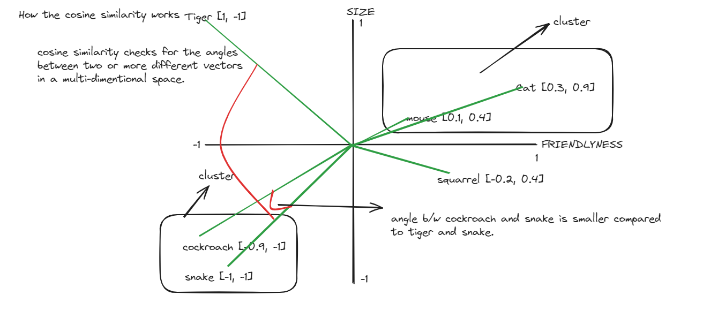

# Embeddings and Similarity in OpenAI

#### 1.1 What is Embedding

- Embedding is a way of converting discrete(individual, unique distinct), categorical data into continuous vectors (in a floating point numbers representation), typically in an array like form called vector `(more about vector below)`

- This process transforms complex, hard-to-process items (like words, images, or user IDs) into a form that a machine learning model can understand and work with more effectively.

- `Embedding latest space:` The space where words with similar meanings are placed, which allows the model to understand the relationships between words and phrases. Example: `king` and `queen` are similar and are placed close to each other in the vector space.

- Vector Embedding is a type of vector data representation that carries within it semantic information that’s critical for the AI to gain understanding and maintain a long-term memory. The AI can use this information to make predictions, recommendations, decisions and executing complex tasks.

- In easy words, embeddings are a floating point numbers representation of textual data (text, images, audio etc) that are converted into an array of numbers (semantic information) like structure (vector list). Data with close/similar meaning are placed close to each other, and vice versa for the dissimilar data. Embedding is used to measure the relatedness of the data.

- Use Cases:

  - Search, Clustering of simiar Data, Recommendation system, Diversity measurement, Classifications etc.

- https://www.pinecone.io/learn/vector-database/
- https://platform.openai.com/docs/guides/embeddings/what-are-embeddings
- https://medium.com/@eugenesh4work/what-are-embeddings-and-how-do-it-work-b35af573b59e

### 1.2 How the embeddings work / Dot product similarity?

- Embeddings are generated by AI models (such as Large Language Models) and have many attributes or features (multi dimensional), making their representation challenging to manage. In the context of AI and machine learning, these features represent different dimensions of the data that are essential for understanding patterns, relationships, and underlying structures by the AI model.

- We can have more dimensions (multi-dimensional space) and more parameters in the embeddings. The general idea remains the same.

- For our easiness, we only used 2 dimension.

### 1.3 What is cosine similarity?

- Cosine similarity is a metric used to measure how similar the documents are irrespective of their size. Mathematically, it measures the cosine angle between two vectors projected in a multi-dimensional space.

### 1.4 What is Vector?

- A vector is a respresentation of a point in a multi-dimensional space. It is a list of floating point numbers that represent the magnitude and direction of a point.

### 1.5 What is a Vector Database?

- A vector database is a database that stores the vectors in a multi-dimensional space. It is used to store the embeddings of the data and to perform the similarity and other operations on the data.

### 1.6 What is Embedding Models in OpenAI?

- https://platform.openai.com/docs/guides/embeddings/embedding-models

### Imporatnt resources:

- - https://www.youtube.com/watch?v=8KrTO9bS91s

- continue with 5 vector db directory to learn more about embeddings, vector databases and real world applications.
