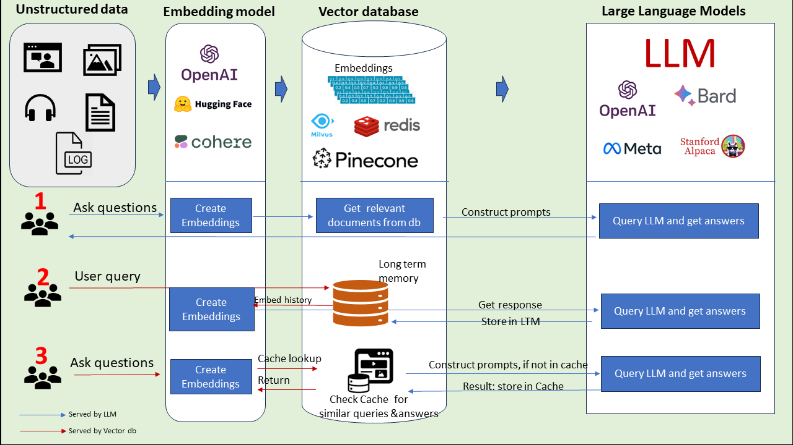

# Vector Databases - ChromeDB and Pinecone

### In this Repo:

    - Explaining the Vector Database and its importance.
    - ChromaDB
    - Pinecone
    - Project: "Chat with your own Data" (FAQ Chatbot)
    - src directory contains all files.

#### 1.1 What is Embedding?

- Check 4 openai-embedding-similarity-vector directory.

- Embeddings are generated by AI models (such as Large Language Models) and have many attributes or features (multi dimensional), making their representation challenging to manage. In the context of AI and machine learning, these features represent different dimensions of the data that are essential for understanding patterns, relationships, and underlying structures by the AI model.

#### 1.2 What is Vector Database and why do we use it?

- Before of the challenging multi-dimensional characteristic of embedding (check 1.1). Vector DBs filful it's requirements for handling such challenging embeddings.

- Vector Database offers indexes and stores vector embeddings in a way that makes it easy and fast for data retrieval and similarity search.

- Before storing the embedded data into vector DB. it is a good practice to break it into smaller chunks.

- Vector Databases are (just like any traditional databases) can perform CRUD operations, but the main difference is that they are optimized for vector data and they can do metadata storage filerting (vector db can add metadata along wih each vector entry), server scaling (when using pinecode as a cloud vector db) and more.
- We use Vector db to add knowledge to our AI, like sementic information retrieval (based on the meaning of the text/context e.g king and queen), long term memory, training over the private dataset, similarity search (ex: give me all dogs images from these 100 images, give ma all AR Rehman songs) etc.

- Below is the diagram to show 3 ways to use vector databases [source](https://www.linkedin.com/pulse/3-ways-vector-databases-take-your-llm-use-cases-next-level-mishra/):
  

#### 1.3 Some popular Vector Dbs:

- Pinecone
- ChromaDB
- Redis
- PostgreSQL - with the help of plugins like `pg_vector`
- and many more

#### 1.4 What is Vector Indexes?

- Vector indexes are the indexes that are stored along with each embedding in the vector database. These indexes are assigned to the similar embeddings (cluster). Indexes help with the fast retrieval when queried.

#### 1.5 What is chromaDB?

- ChromeDB is free open source vector embedding database. Chroma makes it easy to build LLM apps by making knowledge, facts, and skills pluggable for LLMs.

- ChromeDB doesn't itself embed the textual data, rather it expects the embeddings to be provided by the user. However, chromeDB provides wrapper for popular embedding models like OpenAI, Google Gemini, HuggingFace etc to make it easy to use with chromeDB.

- System requirements are to install docker and python to run chromeDB locallty.

- Follow these steps to run chromaDB in docker container

  - https://docs.trychroma.com/deployment/aws#docker

- All endpoints of chromeDb

  - http://localhost:8000/docs

- Integrate chromaDB with OpenAI Embedding Model

  - https://docs.trychroma.com/integrations/openai

- Important Links:
  - https://docs.trychroma.com/getting-started
  - https://www.npmjs.com/package/chromadb

#### What is Pinecone?

- Pinecone is a cloud-based (managed) vector database that is optimized for vector data. Pinecone is a fully managed service that provides a simple API to store, index, and search vector data at scale.

- It provides all the features of chromadb as well as they are cloud based.

- https://docs.pinecone.io/guides/get-started/quickstart

#### What is an index in Pinecone?

- Index is the top level organizational container of vector data. An index can accept, store, queries over the vector data is contains.

- https://docs.pinecone.io/guides/indexes/understanding-indexes

#### What is a namespace in Pinecone?

- Namespace is a sub-organizational container within an index. It is used to group similar data with-in an index together. Queries and option operations are then limited to that one namespace, so different requests can search different subsets of your index.

- Every index is made up of one or more namespaces. Every record exists in exactly one namespace.

- https://docs.pinecone.io/guides/indexes/use-namespaces

#### What is MetaData in Pinecone?

- Pinecone lets you attach metadata key-value pairs, as key-value pairs in a JSON object where keys are strings and values can be of other types, to vectors in an index, and specify filter expressions when you query the index.

- The metadata filters can be combined with AND and OR:

  - $eq - Equal to (number, string, boolean)
  - $ne - Not equal to (number, string, boolean)
  - $gt - Greater than (number)
  - $gte - Greater than or equal to (number)
  - $lt - Less than (number)
  - $lte - Less than or equal to (number)
  - $in - In array (string or number)
  - $nin - Not in array (string or number)
  - $exists - Has the specified metadata field (boolean)

- example query (example code is in python):

```
  index.query(
    vector=[0.1, 0.1, 0.1, 0.1, 0.1, 0.1, 0.1, 0.1],
    filter={ // here you can filter based on the metadata
        "genre": {"$eq": "documentary"},
        "year": 2019
    },
    top_k=1,
    include_metadata=True
)
```

- https://docs.pinecone.io/guides/data/filter-with-metadata

### Imporatnt resources:

- MUST WATCH -> https://www.youtube.com/watch?v=8KrTO9bS91s
- https://www.pinecone.io/learn/vector-database/
- https://docs.trychroma.com/integrations/openai
