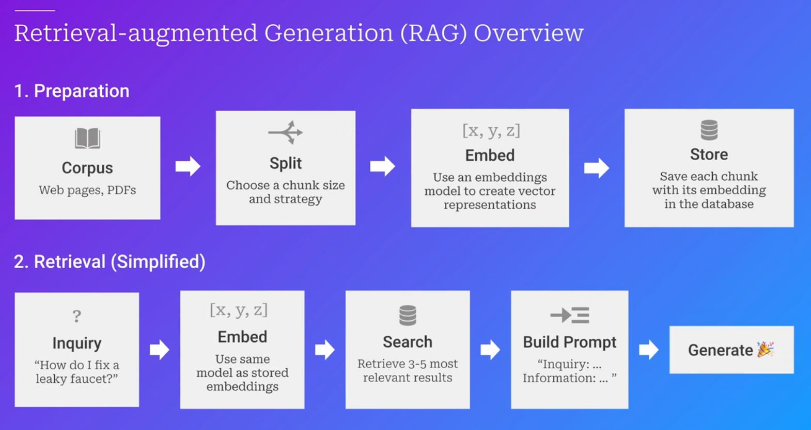

# Langchain | Usage | Integration | RAGs

### In this Repo:

- What and why langchain
- Integrations with ChromaDB and OpenAI
- RAGs
  - Basic Rag Application using hardcode data
  - RAG Application using Web parsing using Cheerio (come alternative are puppeteer, playwright)
  - RAG Application with Vector DB using ChromaDB and PDF file

#### 1.1 What is Langchain?

- Langchain is a open-source framework that to build application using LLM by chaining components that can exchange information. Langchain provides tools and abstractions to improve the customization, accuracy, and relevancy of the information the models generate.

#### 1.2 Why is Langchain imporatnt?

- Existing models are trained on a pre-defined set of data where the data is good enough to respond in a general context, but lacks the ability to respond to specific queries. For example, A model trained on a general dataset can answer questions like "What is the capital of India?" but may not be able to answer questions like "What was the Q4 MRR of my company?" because the model was not trained on the data of the company.

- To solve this problem, Langchain can integrate the organizational (private) data and makes it easier to query the model with the data.

#### 1.3 What libraries do langchain framework has?

- `@langchain/core` - Core library for langchain providing basic abstractions.
- `@langchain/community` - third party integrations such as openai, chromadb, etc.
- `langchain` - Chains, agents, and retrieval strategies that make up an application's cognitive architecture.
- `LangSmith` - A developer platform that lets you debug, test, evaluate, and monitor LLM applications.
- and so on

#### 1.4 What are Prompt Templates?\

- https://js.langchain.com/v0.2/docs/concepts/#prompt-templates

#### 1.5 What are RAGs (Retrieval Augmented Generation) ?

- It is the process of optimizing the output of a LLM, so it references an authoritative knowledge base outside of its training data sources before generating a response.

- Ex: RAG Application chatbot to a company to answer their faqs, where the chatbot can refer to the company's internal data to answer the questions.

- So it can take inputs outside from the trained knoweldge base and generate the output.

- Langchain has the packages to extract the private data from different sources (web, search engines, files, etc) to use it in the LLM.

- **Advance RAG Strategy**
  

* https://www.youtube.com/watch?v=tKPSmn-urB4

### Imporatnt resources:

- https://js.langchain.com/v0.2/docs/introduction/
- https://github.com/langchain-ai/langchainjs
- https://js.langchain.com/v0.2/docs/integrations/chat/openai
- https://js.langchain.com/v0.2/docs/integrations/document_loaders/web_loaders/web_cheerio/
- https://js.langchain.com/v0.2/docs/integrations/document_loaders/file_loaders/pdf
- https://js.langchain.com/v0.2/docs/how_to/recursive_text_splitter
