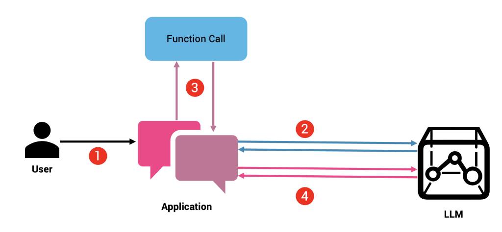

# Fundamentals of OpenAI Function Calling

### 1. **OpenAI Functions**

The source code is a continuation of the source code inside basic directory.

#### 1.1 What are functions calling and what is the need of it

- Function calling are a way to enhance the capabilities of the model and to call external sytems, APIs and tools. Generally, model is trained under a large amount of data for that is used to answer the queries of the user. Sometimes, it happens that the model is not able to generate approriate and accurate answers for the queries because of the limitation of the training data. ex:

  1. The GPT 3.5-turbo is trained until 2021 data and when you ask about the things happened after that, it isn't able to respond to it accurately.
  2. The model isn't able to respond to the real time questions (current date, price of bitcoin, current whether in karachi).

- One of the other usecase along with enhancing the capabilities of the model is that it can use to modify/mutation the date inside a database. LLMs can now execute actions, control devices, retrieve information from databases, and perform a wide range of tasks by leveraging external tools and services.

- The diagram shows how it works.
  

- https://thenewstack.io/a-comprehensive-guide-to-function-calling-in-llms/
- https://platform.openai.com/docs/guides/function-calling

#### 1.2 How to setup function calling

#### 1.3 Sending parameters to the function

#### 1.4 working with multiple functions

### Imporatnt resources:

-
